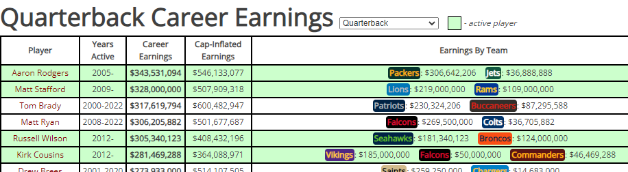

### Study

Predicting the success of NFL Quarterbacks, with emphasis on college performance, pre-draft rankings, and team investment in money and draft capital.

### Data

To gather X features, we will gather the following data for college Quarterback prospects entering the NFL:

**Source**: [https://github.com/jacklich10/nfl-draft-data](https://github.com/jacklich10/nfl-draft-data) (1)

* nfl_draft_profiles.csv: NFL draft prospect data from ESPN dating back to 1967 (4000
  profiles)
* nfl_draft_prospects.csv data on when a prospect was drafted, which team drafted them.
* college_statistics.csv data on counting statistics
* college_qbr.csv detailed quarterpback college performance statistics

The metric used to measure a player's success (our target, y) will be total career earnings, as

> Players who sign contracts with large amounts of guaranteed money, are seen as higher-quality players. (2)

**Source:** https://overthecap.com/career-earnings/quarterback

### References

1. Excellent culling of NFL prospect data by Jack Lich, with highly clean datasets and feature descriptions available on both Kaggle [https://www.kaggle.com/datasets/jacklichtenstein/espn-nfl-draft-prospect-data](https://www.kaggle.com/datasets/jacklichtenstein/espn-nfl-draft-prospect-data) and github [https://github.com/jacklich10/nfl-draft-data](https://github.com/jacklich10/nfl-draft-data)
2. Does Your NFL Team Draft to Win? New Research Reveals Rounds 3, 4, and 5 are the Key to Future On-Field Performance, Chandler Smith, [https://www.samford.edu/sports-analytics/fans/2024/Does-Your-NFL-Team-Draft-to-Win-New-Research-Reveals-Rounds-3-4-and-5-are-the-Key-to-Future-On-Field-Performance](https://www.samford.edu/sports-analytics/fans/2024/Does-Your-NFL-Team-Draft-to-Win-New-Research-Reveals-Rounds-3-4-and-5-are-the-Key-to-Future-On-Field-Performance)

### Other Studies

1. Using Machine Learning and College Profiles to Predict NFL Success, [Northwestern Sports Analytics Group](https://sites.northwestern.edu/nusportsanalytics/ "Northwestern Sports Analytics Group") [https://sites.northwestern.edu/nusportsanalytics/2024/03/29/using-machine-learning-and-college-profiles-to-predict-nfl-success/]()
2. Predicting QB Success in the NFL, [Adam McCann](https://www.linkedin.com/in/adam-mccann-bb94774/), Chief Data Officer at KeyMe, [https://duelingdata.blogspot.com/2017/04/predicting-qb-success-in-nfl.html]()
3. NFL Draft Day Dreams: Analyzing the Success of Drafted Players vs. Undrafted Free Agents, Breanna Wright and Major Bottoms Jr. [https://www.endava.com/insights/articles/nfl-draft-day-analyzing-the-success-of-drafted-players-vs-undrafted-free-agents]()

### Data of interest:

|                |           |                       |
| :------------- | :-------- | :-------------------- |
| school_abbr    | character | school abbreviation   |
| weight         | double    | weight (lbs)          |
| height         | double    | height (inches)       |
| link           | character | player link           |
| pick           | integer   | pick in round         |
| overall        | integer   | overall pick in draft |
| round          | integer   | round in draft        |
| traded         | logical   | pick traded?          |
| trade_note     | character | trade note            |
| team           | character | NFL team              |
| team_abbr      | character | NFL team abbreviation |
| team_logo_espn | character | NFL team logo         |
| pos_rk         | double    | ESPN position rank    |
| ovr_rk         | double    | ESPN overall rank     |
| grade          | double    | ESPN player grade     |
| player_image   | character | player image          |

`nfl_draft_profiles.csv`

Information on NFL draft prospects including pre-draft text analysis in columns `text*` for * in 1, 2, 3, 4.

| variable     | class     | description           |
| :----------- | :-------- | :-------------------- |
| player_id    | character | unique player ID      |
| guid         | character | guid                  |
| player_name  | character | player name           |
| position     | character | position              |
| pos_abbr     | character | position abbreviation |
| weight       | double    | weight (lbs)          |
| height       | double    | height (inches)       |
| player_image | character | player image          |
| link         | character | player link           |
| school_logo  | character | school logo           |
| school       | character | school                |
| school_abbr  | character | school abbreviation   |
| school_name  | character | school name           |
| pos_rk       | double    | ESPN position rank    |
| ovr_rk       | double    | ESPN overall rank     |
| grade        | double    | ESPN player grade     |
| text1        | character | prospect analysis 1   |
| text2        | character | prospect analysis 2   |
| text3        | character | prospect analysis 3   |
| text4        | character | prospect analysis 4   |

`college_qbr.csv`

ESPN college QB QBR metrics for every quarterback in college football since 2004. Please join in this dataset using `guid` and `player_name`.

| variable     | class     | description                                                                                                                            |
| :----------- | :-------- | :------------------------------------------------------------------------------------------------------------------------------------- |
| season       | integer   | college season                                                                                                                         |
| guid         | character | guid                                                                                                                                   |
| player_name  | character | player name                                                                                                                            |
| age          | double    | current age                                                                                                                            |
| total_qbr    | double    | Adjusted Total QB Rating, which values the QB on all play types on a 0-100 scale adjusted for the strength of opposing defenses faced. |
| points_added | double    | Number of points contributed by a QB, accounting for QBR and how much he plays, above the level of an average quarterback.             |
| qb_plays     | double    | Plays on which the QB has a non-zero expected points contribution. Includes most plays that are not handoffs.                          |
| total_epa    | double    | Total expected points added with low leverage plays, according to ESPN Win Probability model, down-weighted.                           |
| pass         |           |                                                                                                                                        |

|                      |           |                        |
| :------------------- | :-------- | :--------------------- |
| player_name          | character | player name            |
| pos_abbr             | character | position abbreviation  |
| school               | character | school                 |
| school_abbr          | character | school abbreviation    |
| school_primary_color | character | school primary color   |
| school_alt_color     | character | school alternate color |
| season               | integer   | college season         |
| statistic            | character | statistic              |
| value                | double    | statistic value        |
| active               | logical   | active player?         |
| all_star             | logical   | all star in college?   |
